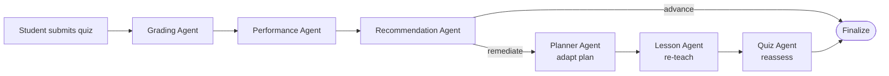
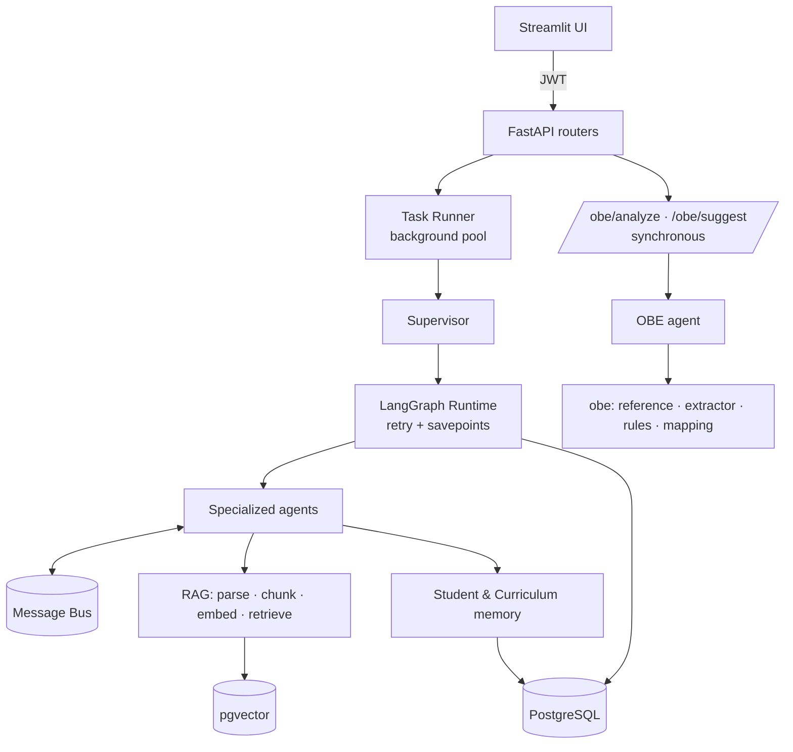

# AdaptED — An Intelligent Multi-Agent Adaptive Education Assistant

> A supervisor-orchestrated, multi-agent AI platform that turns a teacher's raw
> course materials into a personalized, adaptive learning experience for every
> student — powered by RAG, a persistent student memory, and cooperating agents —
> and helps faculty author OBE-compliant course outlines.

<p>
  
  
  
  
  
</p>

> **New:** an **OBE Mapping Agent** that validates course outlines' CO ↔ PO ↔ Bloom ↔ K-P-A
> mappings against the AIUB CS OBE Manual. See [the OBE section](#the-obe-mapping-agent-co--po-assistant)
> and **[SETUP.md](SETUP.md)** to run it.

---

## Table of Contents

- [What it does](#what-it-does)
- [The agents](#the-agents)
- [How it works — the adaptive loop](#how-it-works--the-adaptive-loop)
- [The OBE Mapping Agent (CO → PO assistant)](#the-obe-mapping-agent-co--po-assistant)
- [Architecture](#architecture)
- [Student memory](#student-memory)
- [Project layout](#project-layout)
- [Getting started](#getting-started)
- [Using the agent pipeline](#using-the-agent-pipeline)
- [Testing](#testing)
- [Tech stack](#tech-stack)

---

## What it does

A teacher uploads a **textbook, syllabus, curriculum, or course material**. AdaptED
uses **Retrieval-Augmented Generation (RAG)** to understand that content and organize
it into chapters, topics, subtopics, and learning objectives.

A **Supervisor agent** then coordinates the specialized agents to run the full teaching
loop — planning, teaching, assessing, grading, diagnosing, and recommending — while a
persistent **Student Learning Profile** keeps every session aware of the learner's past
results, mastery, strengths, and weaknesses.

Separately, faculty can use the **OBE Mapping Agent** to check a course outline's
outcome mappings for compliance before sign-off.

- **For teachers** — cuts the effort of preparing lessons, assessments, study plans, and
  **OBE course-outline mappings**, and gives visibility into student performance.
- **For students** — a personal AI tutor that adapts to individual strengths and gaps.

---

## The agents

Every agent subclasses `BaseAgent`, declares the message **actions** it handles, and
returns output validated against a Pydantic schema. The Supervisor routes work between
them over a persisted message bus.

| Agent | Name | Action(s) | Responsibility |
|-------|------|-----------|----------------|
| **Supervisor** | `supervisor` | `supervisor.route` | Classifies intent, routes to agents, coordinates workflows, records every hop |
| **Curriculum Agent** | `curriculum_agent` | `curriculum.analyze` | Parses uploaded documents; extracts chapters, topics, objectives, prerequisites & difficulty; indexes content into the vector store |
| **Study Planner Agent** | `planner_agent` | `plan.create`, `plan.modify` | Builds and adapts personalized study schedules |
| **Lesson Agent** | `lesson_agent` | `lesson.generate` | Generates curriculum-grounded lessons at a target level |
| **Quiz Agent** | `quiz_agent` | `quiz.generate` | Creates personalized assessments and reassessments |
| **Grading Agent** | `grading_agent` | `attempt.grade` | Evaluates student answers, scores attempts, gives feedback |
| **Performance Agent** | `performance_agent` | `performance.analyze` | Surfaces weak/strong topics, topic mastery, and misconceptions |
| **Recommendation Agent** | `recommendation_agent` | `recommend.generate` | Decides what the student should study next |
| **OBE Mapping Agent** ⭐ | `obe_agent` | `obe.extract`, `obe.validate`, `obe.suggest_mapping`, `obe.summarize` | Extracts & validates CO ↔ PO ↔ Bloom ↔ K-P-A mappings from a course outline against the OBE Manual; suggests fixes; drafts the mapping summary |

### Supervisor intents

`analyze_curriculum` · `create_plan` · `adapt_plan` · `generate_lesson` ·
`generate_quiz` · `quiz_submit` · `generate_recommendation` · `generate_reassessment` ·
`extract_outline` · `validate_outline` · `suggest_co_mapping` · `analyze_outline`

---

## How it works — the adaptive loop

The headline student workflow is **`quiz_submit`** — one action that fans out into a
linear multi-agent adaptive pipeline:



Grade → analyze performance → recommend → adapt plan → re-teach → reassess. Each agent's
output is chained forward as context to the next (`graph/runtime.py`), with bounded
retries and per-attempt savepoints.

---

## The OBE Mapping Agent (CO → PO assistant)

Every AIUB CS course outline defines **≥ 4 Course Outcomes (COs)**, each mapped to a
**Program Outcome (PO)** indicator, a **Bloom's Taxonomy level**, and **K-P-A indicators**
(Knowledge `K1-K8`, Problem `P1-P7`, Activity `A1-A5`). Doing this by hand across a 6–7
page template is slow and error-prone. The OBE agent automates the checking.

**What it does**

1. **Extract** the CO matrix, PO indicators, K-P-A, weekly plan and assessment map from a
   PDF/DOCX/text outline (it reads **DOCX tables**, where the mappings actually live).
2. **Validate** against the AIUB CS OBE Manual — deterministic rules that catch:
   - verb ↔ Bloom-level mismatches (e.g. "Explain" tagged as *Evaluating*),
   - POs referenced but never defined,
   - the CO matrix and assessment table disagreeing on a CO's PO,
   - complex-problem COs missing P-attributes, weak Bloom spread, un-assessed COs, etc.
3. **Suggest** the Bloom level, PO family and K-P-A for a CO — each with a rationale that
   cites the OBE Manual.
4. **Summarize** the mapping methodology as a Markdown document.

It is **non-destructive** — it reports and suggests; it never edits the source outline.
Integrity checks are **deterministic and offline**; the LLM is optional (summary polish).

**Use it from the UI** — sign in as a teacher → **OBE Mapping** → upload an outline.
**Or via the API:**

```bash
curl -X POST http://localhost:8001/obe/analyze \
  -H "Authorization: Bearer <TEACHER_JWT>" \
  -F "file=@'CSC 2209 Object Oriented Analysis and Design.docx'"
```

Full step-by-step (including whether you need an API key) is in **[SETUP.md](SETUP.md)**.

---

## Architecture



- **LangGraph pipeline** compiled per run, with conditional routing driven by intent.
- **Bounded retries with savepoints** — a failed agent attempt rolls back only its own writes.
- **Full observability** — every task, message hop, and audit event is persisted.
- The **OBE agent runs synchronously** (deterministic, fast) via its own `/obe` router,
  needing no course/document setup — just upload an outline.

---

## Student memory

The **Student Learning Profile** (`memory/student_memory.py` + `memory` models) persists
topic mastery, study history, detected misconceptions, conversation memory, learning
preferences, and recommendation history — read by the Planner, Lesson, Quiz, Performance,
and Recommendation agents so future work is tailored to the individual learner.

---

## Project layout

```
src/adapted/
├── agents/            # Supervisor + 8 specialized agents, base class & message bus
│   ├── obe_agent.py       # ⭐ OBE Mapping & Compliance agent
│   └── …                  # curriculum, planner, lesson, quiz, grading, performance, recommendation
├── obe/               # ⭐ OBE domain logic (no DB, offline-capable)
│   ├── reference.py       # AIUB CS OBE Manual vocabulary (POs, Bloom verbs, K-P-A)
│   ├── extractor.py       # parse an outline's text into structure
│   ├── document.py        # table-aware PDF/DOCX reader (from path or bytes)
│   ├── rules.py           # deterministic validation rules -> findings
│   ├── mapping.py         # CO -> Bloom/PO/K-P-A suggestions with rationale
│   ├── summary.py         # mapping-methodology summary generator
│   ├── schema.py          # Pydantic models for extraction/findings/suggestions
│   └── runner.py          # DB-free entry points (used by the API + tests)
├── graph/runtime.py   # LangGraph pipeline: routing, retries, savepoints
├── api/routers/       # auth, courses, curriculum, study_plans, lessons, quizzes,
│                      #   students, teacher, agent, agent_ops, logs, users, obe ⭐
├── llm/               # Provider abstraction (mock | OpenAI-compatible) + registry
├── rag/               # parser · chunker · embeddings · vector_store · retriever
├── memory/            # curriculum_memory (vectors) + student_memory (profile)
├── models/            # SQLAlchemy models
├── services/          # analytics · grading · mastery · scheduler (pure logic)
├── ui/                # Streamlit app (incl. the OBE Mapping page) + API client
├── config.py          # pydantic-settings configuration
└── main.py            # FastAPI application factory
test/                  # pytest suite (incl. test_obe.py, test_obe_agent.py)
```

---

## Getting started

See **[SETUP.md](SETUP.md)** for the complete guide (prerequisites, database, environment,
API keys, running the API + UI, and using the OBE agent). In brief:

```bash
uv sync
cp .env.example .env          # then fill in DATABASE_URL (and, optionally, an LLM key)
uv run uvicorn adapted.main:app --port 8001 --reload
uv run streamlit run src/adapted/ui/app.py
```

- **Offline mode:** leave `LLM_PROVIDER=mock` to run everything deterministically with no
  API key. The OBE agent's validation is deterministic and works entirely offline.
- **Real LLM content:** set `LLM_PROVIDER=openrouter` + `OPENROUTER_API_KEY` — see SETUP.md.

---

## Using the agent pipeline

Kick off any student/teacher workflow through the async agent endpoint (returns a
`task_id`; poll `GET /agent/tasks/{task_id}`):

```bash
curl -X POST http://localhost:8001/agent/run \
  -H "Authorization: Bearer <JWT>" -H "Content-Type: application/json" \
  -d '{"intent":"analyze_curriculum","payload":{"course_id":"<id>","document_id":"<id>"}}'
```

The OBE endpoints (`POST /obe/analyze`, `POST /obe/suggest`) are **synchronous** and
return the full result immediately.

---

## Testing

```bash
uv run pytest -q
```

- `test/test_obe.py` — the OBE reference data, rules, mapper, extractor and the full
  extract → validate → summarize pipeline, including a real AIUB DOCX outline end-to-end.
- `test/test_obe_agent.py` — the OBE agent dispatch and runner (these import the model
  layer and so require `DATABASE_URL` to be set; they skip automatically otherwise).

---

## Tech stack

**Multi-Agent AI · RAG · Shared Memory · PostgreSQL/pgvector · Structured logging**

| Layer | Technology |
|-------|------------|
| Orchestration | LangGraph |
| API / UI | FastAPI + Uvicorn · Streamlit |
| Data / ORM | PostgreSQL, pgvector, SQLAlchemy 2.0, Alembic |
| LLM | OpenAI-compatible client (OpenRouter) with a deterministic mock fallback |
| Documents | pypdf, python-docx |
| Auth | PyJWT, bcrypt |
| Tooling | uv, ruff, pytest |
