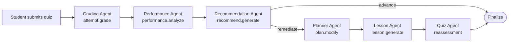
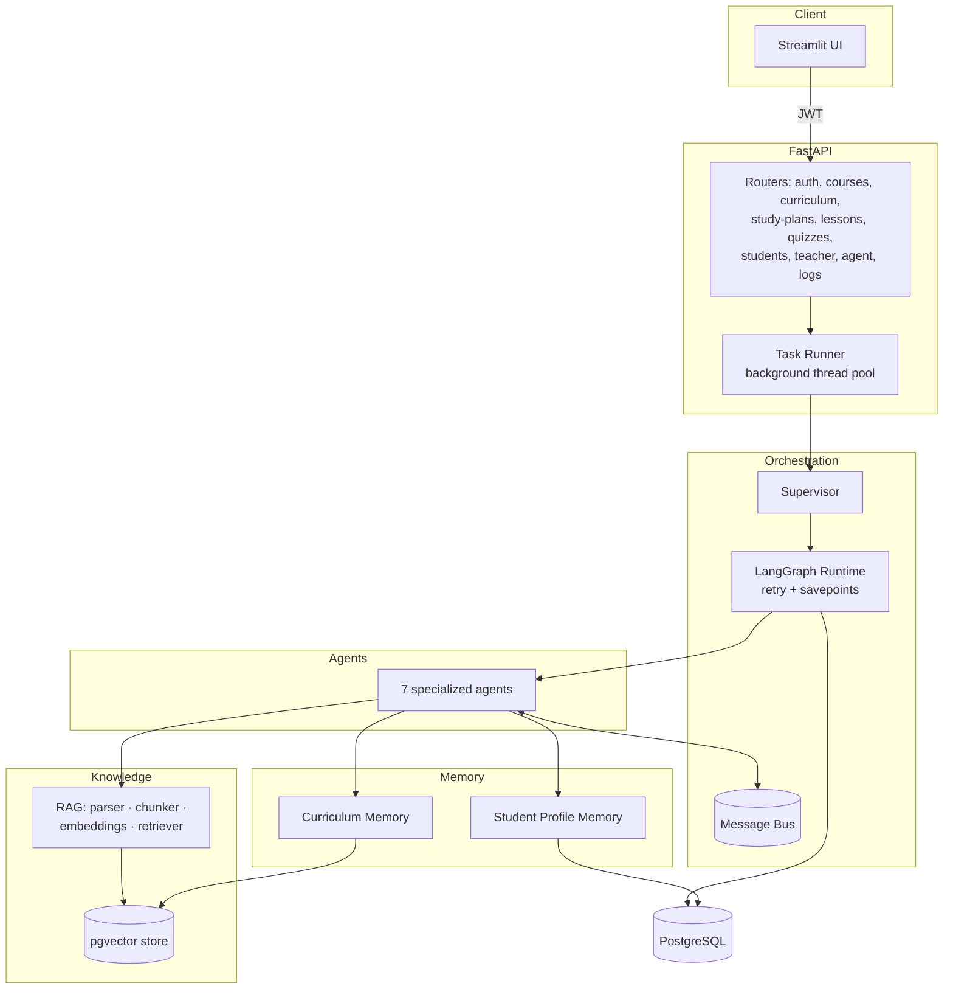

# AdaptED — An Intelligent Multi-Agent Adaptive Education Assistant

> A supervisor-orchestrated, multi-agent AI platform that turns a teacher's raw
> course materials into a personalized, adaptive learning experience for every
> student — powered by RAG, a persistent student memory, and eight cooperating
> agents.

<p>
  
  
  
  
  
</p>

---

## Table of Contents

- [What it does](#what-it-does)
- [The agents](#the-agents)
- [How it works — the adaptive loop](#how-it-works--the-adaptive-loop)
- [Architecture](#architecture)
- [Student memory](#student-memory)
- [Project layout](#project-layout)
- [Getting started](#getting-started)
- [Configuration](#configuration)
- [Running the platform](#running-the-platform)
- [Using the agent pipeline](#using-the-agent-pipeline)
- [Tech stack](#tech-stack)
- [Design principles](#design-principles)

---

## What it does

A teacher uploads a **textbook, syllabus, curriculum, or course material**. AdaptED
uses **Retrieval-Augmented Generation (RAG)** to understand that content and organize
it into chapters, topics, subtopics, and learning objectives.

A **Supervisor agent** then coordinates **seven specialized agents** to run the full
teaching loop — planning, teaching, assessing, grading, diagnosing, and recommending —
while a persistent **Student Learning Profile** keeps every session aware of the
learner's past results, mastery, strengths, and weaknesses.

- **For teachers** — cuts the effort of preparing lessons, assessments, and study
  plans, and gives visibility into student performance.
- **For students** — a personal AI tutor that adapts to individual strengths and gaps,
  and never treats a session as a blank slate.

---

## The agents

Every agent subclasses `BaseAgent`, declares the message **actions** it handles, and
returns output validated against a Pydantic schema. The Supervisor routes work between
them over a persisted message bus.

| Agent | Name | Action(s) | Responsibility |
|-------|------|-----------|----------------|
| **Supervisor** | `supervisor` | `supervisor.route` | Classifies intent, routes to agents, coordinates workflows, records every hop |
| **Curriculum Agent** | `curriculum_agent` | `curriculum.analyze` | Parses uploaded documents; extracts chapters, topics, objectives, prerequisites & difficulty; indexes content into the vector store |
| **Study Planner Agent** | `planner_agent` | `plan.create`, `plan.modify` | Builds and adapts personalized study schedules (prerequisite-aware, deadline- and capacity-bounded) |
| **Lesson Agent** | `lesson_agent` | `lesson.generate` | Generates curriculum-grounded lessons and explanations at a target level (standard / remedial) |
| **Quiz Agent** | `quiz_agent` | `quiz.generate` | Creates personalized assessments and reassessments; de-duplicates questions |
| **Grading Agent** | `grading_agent` | `attempt.grade` | Evaluates student answers, scores attempts, and provides feedback |
| **Performance Agent** | `performance_agent` | `performance.analyze` | Analyzes scores to surface weak/strong topics, topic mastery, and misconceptions |
| **Recommendation Agent** | `recommendation_agent` | `recommend.generate` | Decides what the student should study next (advance / remediate / reassess) |

### Supervisor intents

The Supervisor exposes these workflow intents (see `agents/supervisor.py`):

`analyze_curriculum` · `create_plan` · `adapt_plan` · `generate_lesson` ·
`generate_quiz` · `quiz_submit` · `generate_recommendation` · `generate_reassessment`

---

## How it works — the adaptive loop

The headline workflow is **`quiz_submit`** — a single student action that fans out
into a linear multi-agent adaptive pipeline:



1. **Grade** the submitted attempt.
2. **Analyze** performance → weak topics, mastery, misconceptions.
3. **Recommend** the next action. If the student has mastered the material, the pipeline
   short-circuits to *advance*; otherwise it continues.
4. **Adapt** the study plan around the weak topics.
5. **Re-teach** with a remedial lesson.
6. **Reassess** with a fresh quiz variant.

Each agent's output is chained forward as context to the next (`graph/runtime.py`).

---

## Architecture



**Orchestration highlights**

- **LangGraph pipeline** compiled per run, with conditional routing driven by intent.
- **Bounded retries with savepoints** — a failed agent attempt rolls back only its own
  writes via a nested transaction, never the work of earlier agents.
- **Empty-output detection** — schema-valid-but-vacuum LLM output (e.g. `{"chapters": []}`)
  is treated as a failure and retried rather than silently "succeeding".
- **Full observability** — every task, message hop, and audit event is persisted
  (`agent_tasks`, `agent_messages`, `audit_logs`) and exposed via the `/agent` and
  `/logs` routers.
- **Async execution** — `POST /agent/run` returns a task id immediately; the pipeline
  runs in a worker thread with its own DB session and is polled via
  `GET /agent/tasks/{task_id}`.

---

## Student memory

AdaptED does **not** treat each session as new. The **Student Learning Profile**
(`memory/student_memory.py` + the `memory` models) persists:

- **Topic mastery** and status per topic (`student_mastery`)
- **Study history** (`study_history`)
- **Misconceptions** detected during grading (`misconceptions`)
- **Conversation memory** (`conversation_memory`)
- **Learning preferences** (`learning_preferences`)
- **Recommendations** history (`recommendations`)

This profile is read by the Planner, Lesson, Quiz, Performance, and Recommendation
agents so that future lessons, quizzes, and plans are tailored to the individual learner.

---

## Project layout

```
src/adapted/
├── agents/            # Supervisor + 7 specialized agents, base class & message bus
│   ├── base.py            # BaseAgent: validation, retry-friendly handle()
│   ├── message.py         # AgentMessage + persisted MessageBus
│   ├── supervisor.py      # intent → workflow routing
│   ├── curriculum_agent.py
│   ├── planner_agent.py
│   ├── lesson_agent.py
│   ├── quiz_agent.py
│   ├── grading_agent.py
│   ├── performance_agent.py
│   └── recommendation_agent.py
├── graph/runtime.py   # LangGraph pipeline: routing, retries, savepoints
├── api/               # FastAPI app: routers + auth dependencies
│   ├── deps.py            # JWT auth, role guards (teacher/student)
│   └── routers/          # auth, courses, curriculum, study_plans, lessons,
│                         #   quizzes, students, teacher, agent, agent_ops, logs, users
├── llm/               # Provider abstraction (mock | OpenAI-compatible) + registry
├── rag/               # parser · chunker · embeddings · vector_store · retriever
├── memory/            # curriculum_memory (vectors) + student_memory (profile)
├── models/            # SQLAlchemy models: user, course, curriculum, learning,
│                      #   memory, observability
├── services/          # analytics · grading · mastery · scheduler (pure logic)
├── security/          # jwt · passwords (bcrypt)
├── tools/registry.py  # agent tools: rag_retrieve, web_search, scheduler_validate,
│                      #   mastery_calc, dedupe_check
├── tasks/runner.py    # background thread-pool pipeline runner
├── ui/                # Streamlit app + API client
├── logging/logger.py  # structlog structured logging
├── config.py          # pydantic-settings configuration
└── main.py            # FastAPI application factory
```

---

## Getting started

### Prerequisites

- **Python 3.12+**
- **[uv](https://docs.astral.sh/uv/)** for dependency management
- **PostgreSQL** with the **[pgvector](https://github.com/pgvector/pgvector)** extension
  (used as both the relational store and the vector store)
- *(optional)* An **[OpenRouter](https://openrouter.ai/)** API key for real LLM content —
  the platform runs fully offline with the deterministic `mock` provider by default.

### Install

```bash
git clone https://github.com/0NJS0/AdaptEd.git
cd AdaptEd
uv sync
```

---

## Configuration

Copy the example environment file and fill in your values:

```bash
cp .env.example .env
```

| Variable | Default | Purpose |
|----------|---------|---------|
| `DATABASE_URL` | *(unset)* | PostgreSQL connection string (pgvector-enabled) |
| `LLM_PROVIDER` | `mock` | `mock` for offline/deterministic runs, `openrouter` for real content |
| `OPENROUTER_API_KEY` | *(unset)* | Required when `LLM_PROVIDER=openrouter` |
| `LLM_MODEL` | `openrouter/free` | Chat model id |
| `EMBED_PROVIDER` | `mock` | `mock` or `openrouter` for real embeddings |
| `EMBED_MODEL` | Nemotron embed | Embedding model id |
| `EMBEDDING_DIM` | `2048` | Must match the embedding model's output dimension |
| `SECRET_KEY` | *(change me)* | JWT signing key |
| `SEARXNG_URL` | *(unset)* | Optional SearXNG endpoint for the `web_search` tool |

> **Offline mode:** leave `LLM_PROVIDER=mock` and `EMBED_PROVIDER=mock` to run the entire
> pipeline deterministically with no API keys — ideal for development and testing.

---

## Running the platform

Start the API (creates tables on startup via `init_db()`):

```bash
uv run uvicorn adapted.main:app --port 8001 --reload
```

- Interactive API docs: **http://localhost:8001/docs**
- Health check: **http://localhost:8001/health**

Start the Streamlit UI (in a second terminal):

```bash
uv run streamlit run src/adapted/ui/app.py
```

The UI talks to the API at `ADAPTED_API_URL` (default `http://localhost:8001`).

---

## Using the agent pipeline

Kick off any workflow through the single agent endpoint:

```bash
curl -X POST http://localhost:8001/agent/run \
  -H "Authorization: Bearer <JWT>" \
  -H "Content-Type: application/json" \
  -d '{
        "intent": "analyze_curriculum",
        "payload": { "course_id": "<id>", "document_id": "<id>" }
      }'
```

The call returns immediately with a `task_id`. Poll for the outcome:

```bash
curl http://localhost:8001/agent/tasks/<task_id> \
  -H "Authorization: Bearer <JWT>"
```

Required payload fields per intent:

| Intent | Required payload |
|--------|------------------|
| `analyze_curriculum` | `course_id`, `document_id` |
| `create_plan` / `adapt_plan` | `student_id`, `course_id` |
| `generate_lesson` | `course_id`, `topic_id` |
| `generate_quiz` | `course_id` |
| `quiz_submit` | `attempt_id`, `course_id`, `student_id` |
| `generate_recommendation` | `student_id`, `course_id` |

---

## Tech stack

**Multi-Agent AI · RAG · Shared Memory · PostgreSQL/pgvector · Python tools · APIs · Structured logging · Error handling**

| Layer | Technology |
|-------|------------|
| Orchestration | LangGraph |
| API | FastAPI + Uvicorn |
| UI | Streamlit |
| Data / ORM | PostgreSQL, pgvector, SQLAlchemy 2.0, Alembic |
| LLM | OpenAI-compatible client (OpenRouter) with a deterministic mock fallback |
| Documents | pypdf, python-docx |
| Auth | PyJWT, bcrypt |
| Config / logging | pydantic-settings, structlog |
| Tooling | uv, ruff, pytest |

---

## Design principles

- **Supervisor-first orchestration** — one entry point classifies intent and coordinates
  every agent; agents never call each other directly.
- **Schema-validated agents** — each agent's output is validated before it flows onward,
  so malformed LLM output fails loudly and early.
- **Resilient by construction** — bounded retries, per-attempt savepoints, and
  empty-output detection keep partial progress intact on failure.
- **Observable end to end** — every task and message hop is persisted and queryable.
- **Offline-friendly** — deterministic mock LLM and embedding providers let the whole
  system run and be tested without external services.
```

